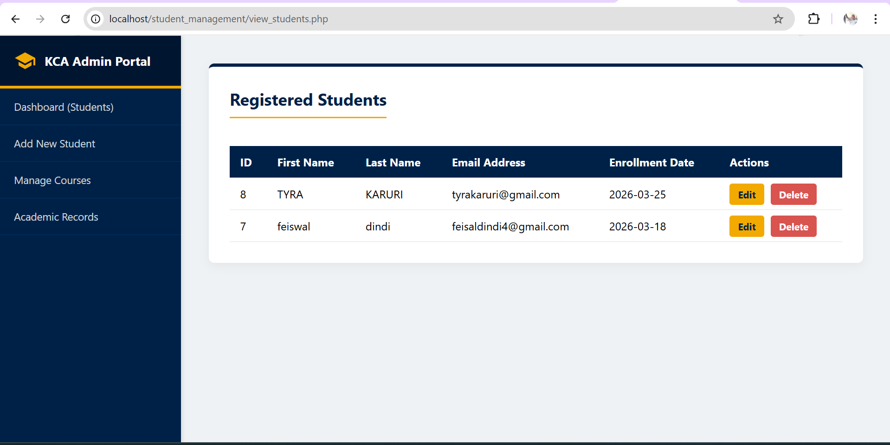
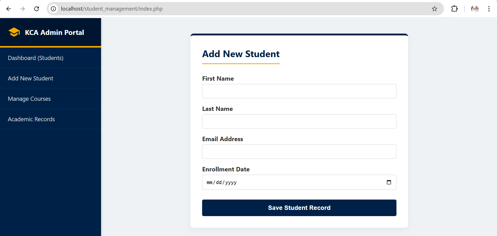
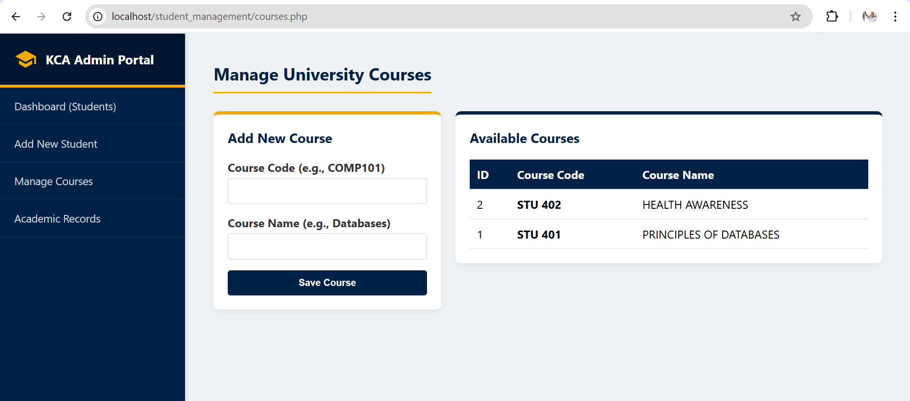
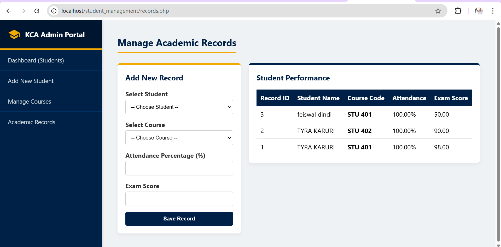

# KCA Student Management System 🎓


A full-stack web application for managing university student records, course catalogs, and academic performance. Built with modular PHP architecture and a responsive custom-styled dashboard.

---

## 📸 Screenshots

### Dashboard - View All Students


### Add New Student


### Manage Courses


### Academic Records (Student-Course Mapping)


---

## Features

- **Full CRUD Operations** - Create, read, update, and delete student records
- **Course Management** - Add and manage course offerings with curriculum codes
- **Academic Records** - Map students to courses with grade tracking using SQL JOINs
- **Responsive Dashboard** - Custom Flexbox layout with fixed sidebar and hover states
- **Modular Architecture** - DRY principles with dynamic header, sidebar, and footer includes

---

## Tech Stack

| Category | Technologies |
|----------|--------------|
| Frontend | HTML5, CSS3, SVGs |
| Backend | PHP (Procedural) |
| Database | MySQL |
| Environment | XAMPP |

---

## Installation

### Prerequisites
- [XAMPP](https://www.apachefriends.org/index.html) with Apache and MySQL modules

### Setup Instructions

```bash
# Clone repository into XAMPP htdocs
cd C:/xampp/htdocs/
git clone https://github.com/yourusername/student_management.git

# Start Apache and MySQL from XAMPP Control Panel
Database Configuration
Navigate to http://localhost/phpmyadmin/

Create database: student_management

Import the provided SQL file to create tables

Connection Settings
Open database.php and verify your MySQL port:

php
$servername = "127.0.0.1";
$username = "root";
$password = "";
$dbname = "student_management";
$port = 3306; // Update to 3307 if using alternate port

$conn = new mysqli($servername, $username, $password, $dbname, $port);
Launch Application
text
http://localhost/student_management/view_students.php
Database Schema
Table	Description
students	Student personal identifiers and enrollment data
courses	University course codes and titles
student_records	Junction table linking students to courses with exam scores
Relationships: Student Records table uses foreign keys to map students and courses with attendance tracking and grade management.

Author
Feiswal Dindi Onyango

text

The screenshots are in the **"📸 Screenshots"** section with each image on its own line. You'll need to:
1. Create an `assets` folder in your project
2. Add your screenshot images there with the exact filenames: `dashboard.png`, `add-student.png`, `courses.png`, `records.png`
